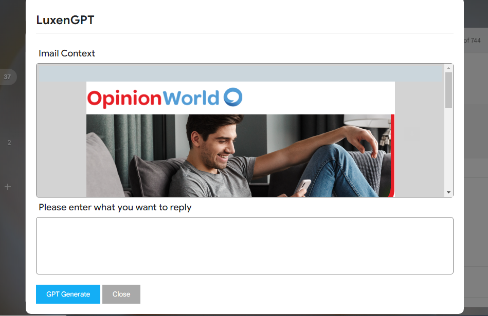
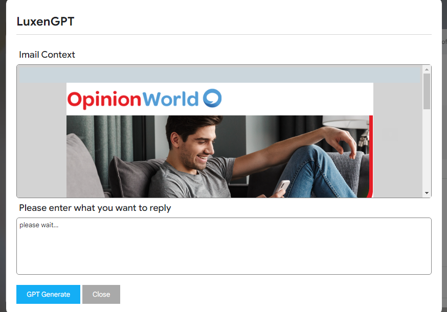
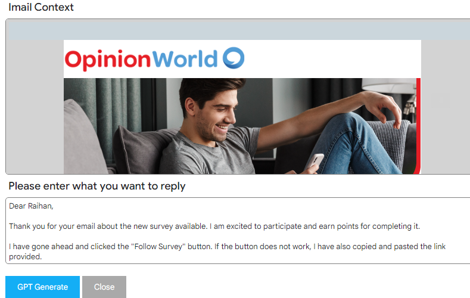

# gmail-chatgpt-extension
source code of the chatgpt extension for the Gmail.com

# Manifest
{
    "manifest_version": 3,
    "name": "LuxenGPT",
    "version": "1.0",
    "description": "An extension that allows you to read and reply to Gmail messages using chat GPT",
    "icons": {
        "128": "icons/128.png",
        "64": "icons/64.png",
        "16": "icons/16.png",
        "32": "icons/32.png"
    },
    "content_scripts": [
        {
            "matches": [
                "https://mail.google.com/*"
            ],
            "js": [
                "gmail.js"
            ],
            "css": ["css/style.css"]
        }
    ],
    "host_permissions": [
        "https://*/",
        "http://*/"
    ],
    "background": {
        "service_worker": "background.js"
    },
    "action": {
        "default_icon": {
            "128": "icons/128.png",
            "64": "icons/64.png",
            "16": "icons/16.png",
            "32": "icons/32.png"
        },
        "default_title": "LuxenGPT"
    },
    "options_ui": {
        "page": "index.html",
        "open_in_tab": true
    },
    "permissions": [
        "storage",
        "tabs",
        "activeTab"
    ]
}

## details

when the user reply the email, ChatGPt modal shows in the gmailbox and generate sender email text using GPT.

